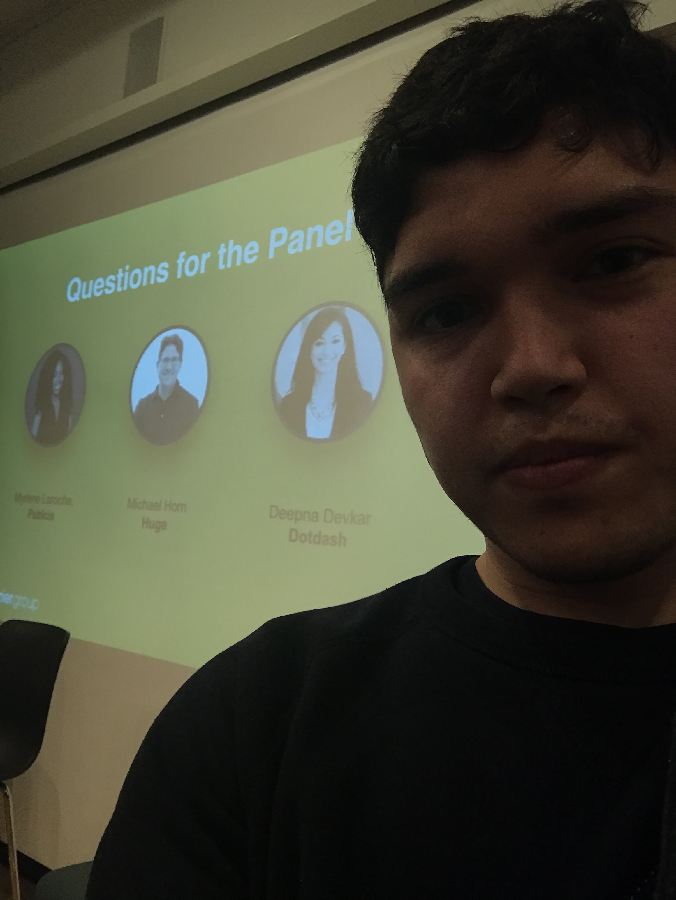

### Talk Data to Me OpenNYC event
In the talk data to me event there were three speakers, each of which spoke about why data was valuable to them, not necessarily with a focus on the openness of data specifically. The first speaker talked about why data was valuable from a marketing perspective and using it to guide marketing campaigns. The second speaker talked about why data was valuable from an AI perspective and how data could be used to shape user experience with software. The third speaker talked about interesting insights from their companies personal data and how that could potentially shape business strategy.

I found the talk interesting although I was surprised that there was no discussion on open data but rather data in general. I found it interesting to gain an understanding of how data can be used in a business setting and why it is a valuable asset for businesses. However, I also found a lot of the value placed on data to be speculative, since everyone seemed to be saying that the data would be valuable if it could be used in specific ways, yet actual applications of what they were proposing didn't exist and may not be feasible or valuable in reality.

Photo:

{:class="img-responsive"}

### Reflection on Dana's talk in class
I think Google's approach to open source is a little weird because they claim to really support open source projects, but it seems that in the projects where Google plays the role of not-so-benevolent dictator, the projects aren't as accessible as they should be to non-google volunteers. I especially don't like the fact that in many of Google's "open source" projects there is the public's "external" version and Google's private "internal" version. It's nice that they make the source code for these projects freely available, but I think that the way that the project is managed is essential to calling a project open source. It seems that although the project is "open source", the project is very much Google's and they develop it according to their needs above all others. I think Stallman would agree that there are atleast a few ethical violations in Google's "open source" projects.

### Team progress
Our team is making progress well and I think we are all happy doing what we're doing. We are focusing on fixing examples that have been broken by API changes, fixing documentation, and making new examples. There are a lot of things to do, and there are few people working on them so we are pretty lucky that there are so many opportunities to contribute.

Personally I have been working on improving the top down game example with Marcus and I think we could submit a pull request this week. He is adding enemy game objects and switching the physics engine, while I am working on adding a moveable camera and reticule game object.

### Code of conduct document

Having a code of conduct document is beneficial because it creates a justification for policing discussion and may potentially prevent discussion that would negatively affect a project. I think having such a document is essentially for policing dicussion by censoring people and topics, and it's redundant for any other purpose, because anyone who wants to do something not allowed by the code of conduct won't have their wants changed just by reading it, and can still do that stuff elsewhere. Phaser has a code of conduct: <https://github.com/photonstorm/phaser-ce/blob/master/CODE_OF_CONDUCT.md>, that is much shorter and in my opinion better than Go's. 

### My Contributions This Week

None
